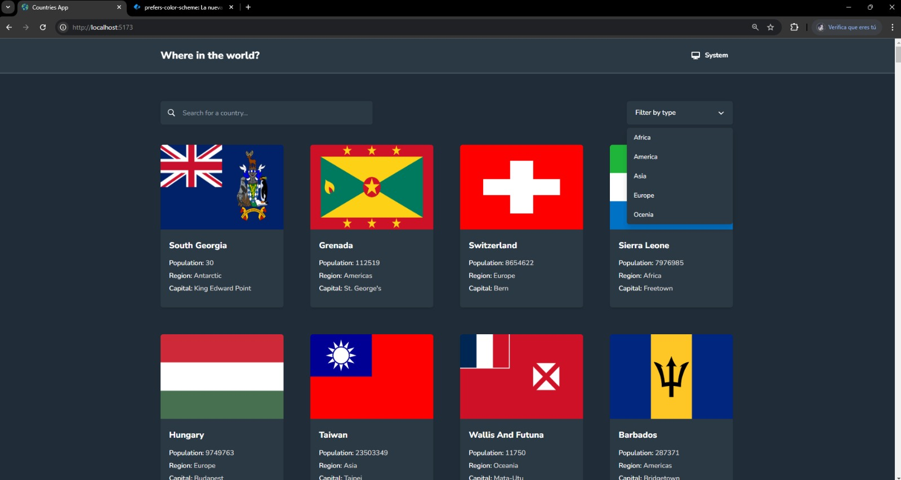
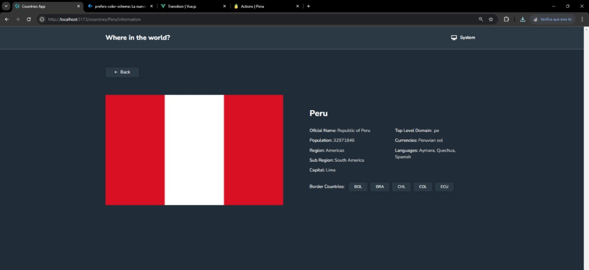

# Frontend Mentor - REST Countries API with color theme switcher

This is a solution to the REST Countries API with color theme switcher challenge on Frontend Mentor. Frontend Mentor challenges help you improve your coding skills by building realistic projects.

## Table of contents

- [Overview](#overview)
  - [The challenge](#the-challenge)
  - [Screenshots](#screenshots)
  - [Links](#links)
- [My process](#my-process)
  - [Built with](#built-with)
  - [Useful resources](#useful-resources)
- [Author](#author)

## Overview

### The challenge

Users should be able to:

- See all countries from the API on the homepage
- Search for a country using an `input` field
- Filter countries by region
- Click on a country to see more detailed information on a separate page
- Click through to the border countries on the detail page
- Toggle the color scheme between light and dark mode *(optional)*

### Screenshots

### Links

- Solution URL: [)
- Live Site URL: [)

## My process

### Built with

- **[Vue + TypeScript (Composition API)](https://v3.vuejs.org/guide/composition-api-introduction.html)** - Crear interfaces dinámicas usando Vue.js y TypeScript con la Composition API
- **[Tailwind (para estilos personalizados)](https://tailwindcss.com/docs)** - Framework CSS basado en utilidades para diseñar rápidamente.
- **[Pinia (gestión de estado)](https://pinia.vuejs.org/)** - Una solución simple y eficiente para la gestión del estado en Vue.js
- **[Vue Transitions](https://v3.vuejs.org/guide/transitions.html)** - Añadir transiciones suaves y animaciones interactivas en Vue
- **[HTML5](https://developer.mozilla.org/en-US/docs/Web/Guide/HTML/HTML5)** - La última versión de HTML, lenguaje estándar para crear páginas web
- **[Vue Router](https://router.vuejs.org/)** - El enrutador oficial de Vue.js para gestionar la navegación en la aplicacion

### Useful resources

- **[Mobile-first workflow](https://developer.mozilla.org/en-US/docs/Web/Guide/Responsive_web_design)** - Diseño centrado en dispositivos móviles, adaptándose luego a pantallas más grandes
- **[Font Awesome](https://fontawesome.com/docs)** - Iconos escalables que se pueden personalizar con CSS
- **[CSS Grid y Flexbox](https://developer.mozilla.org/en-US/docs/Web/CSS/CSS_Grid_Layout)** - Sistemas de diseño para crear layouts flexibles y responsivos

## Author

- Frontend Mentor - [@Nicolas Esteban](https://www.frontendmentor.io/profile/Nekolas777)